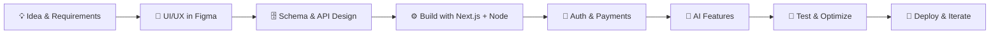

<!-- ============ HEADER ============ -->
<div align="center">


<a href="https://git.io/typing-svg">
  
</a>

<br/><br/>

[](https://your-portfolio-link.com)
[](https://www.linkedin.com/in/rohit-rawat-78533b334)
[](mailto:rohit.rawat41161@gmail.com)
[](https://your-resume-link.com)


</div>

---

## 👋 Hey, I'm Rohit

I build **full stack web applications** end to end: responsive frontends, secure APIs, database design, payments and **AI-powered features**. I care about clean architecture, readable code and products people actually use.

<table>
<tr>
<td width="55%" valign="top">

```ts
const rohit = {
  role: "Full Stack Developer",
  core: ["Next.js", "React", "TypeScript", "Node.js"],
  data: ["MongoDB", "PostgreSQL", "Prisma", "Convex"],
  ai: ["OpenAI API", "Google Gemini"],
  auth: ["Clerk", "JWT"],
  payments: ["Stripe"],
  learning: ["System Design", "Testing", "Docker", "CI/CD"],
  lookingFor: ["Internship", "Full-time", "Freelance", "OSS"],
};
```

</td>
<td width="45%" valign="top">

- 🔭 **Building:** AI-powered SaaS products
- 🌱 **Learning:** system design & scalable backends
- 🧪 **Next:** automated testing + CI/CD on every project
- 🤝 **Open to:** collaboration & open-source
- ⚡ **Ask me about:** Next.js, AI integration, auth flows

</td>
</tr>
</table>

---

## 🧰 Tech Stack

<div align="center">


</div>

<details>
<summary><b>📋 View stack by category</b></summary>
<br/>

| Area | Technologies |
|---|---|
| **Languages** | JavaScript, TypeScript, Python, C, C++ |
| **Frontend** | React, Next.js (App Router), Tailwind CSS, Vite, HTML5, CSS3 |
| **Backend** | Node.js, Express.js, REST APIs, JWT, Server Actions |
| **Databases** | MongoDB + Mongoose, PostgreSQL, MySQL, Prisma, Convex |
| **AI** | OpenAI API, Google Gemini, prompt design, AI-assisted workflows |
| **Auth & Payments** | Clerk, JWT, Stripe |
| **DevOps & Tools** | Git, GitHub Actions, GitLab CI, Google Cloud, Figma, VS Code |

</details>

---

## 🚀 Featured Projects

<table>
<tr>
<td width="50%" valign="top">

### 🛒 RoyalCart
**Full stack e-commerce platform**

Product catalog, cart, orders, secure auth and payments in a fast, responsive storefront.

`Next.js` `TypeScript` `Tailwind` `MongoDB` `Mongoose` `Clerk` `Payments`

**Highlights**
- Category and product management
- Cart and order lifecycle
- Payment gateway integration
- Fully responsive UI

[🔗 Live Demo](https://your-demo-link.com) · [📂 Code](https://github.com/rohitrawat18/royalcart)

<!--  -->

</td>
<td width="50%" valign="top">

### 🤖 JobPilot AI
**AI-powered job application platform**

Discover relevant jobs, match them against your resume and track every application in one dashboard.

`Next.js` `TypeScript` `MongoDB` `Clerk` `OpenAI` `Recharts`

**Highlights**
- Resume-based job matching
- Application tracking dashboard
- Analytics and data visualization
- AI-assisted career workflows

[🔗 Live Demo](https://your-demo-link.com) · [📂 Code](https://github.com/rohitrawat18/jobpilot-ai)

<!--  -->

</td>
</tr>
<tr>
<td width="50%" valign="top">

### 💰 Expensio AI
**Smart personal finance manager**

Track spending, see a clean dashboard and get AI-generated insights on your financial habits.

`Next.js` `React` `Convex` `Tailwind` `AI`

**Highlights**
- Real-time expense tracking
- Financial dashboard
- AI-powered spending insights
- Modern responsive interface

[🔗 Live Demo](https://your-demo-link.com) · [📂 Code](https://github.com/rohitrawat18/expensio-ai)

</td>
<td width="50%" valign="top">

### 📱 Social Copilot 🚧
**AI social media management SaaS** *(in development)*

An AI assistant for planning, creating and scheduling social content from one place.

`Next.js` `TypeScript` `AI`

**Highlights**
- Content ideation with AI
- Scheduling and planning workflow
- Built as a multi-user SaaS

[📂 Code](https://github.com/rohitrawat18)

</td>
</tr>
</table>

> 📌 **More projects:** see my [pinned repositories](https://github.com/rohitrawat18?tab=repositories) or the full [portfolio](https://your-portfolio-link.com).

---

## 🏗️ How I Build



**Engineering principles I follow**
- 🧱 Clean, modular, maintainable code over clever code
- 🔐 Secure by default: validated inputs, protected routes, safe secrets handling
- ⚡ Performance matters: server components, caching, optimized queries
- 📦 Ship small, iterate fast, and document what I build

---

## 🛠️ What I Can Build For You

| Service | Details |
|---|---|
| 🌐 **Full stack web apps** | Dashboards, SaaS products, e-commerce stores |
| 🤖 **AI integration** | Chat, summarization, matching and insight features using OpenAI / Gemini |
| 🔐 **Auth & payments** | Clerk / JWT auth, Stripe checkout and subscriptions |
| 🧩 **REST API & database design** | Node/Express APIs, MongoDB and PostgreSQL schemas |
| 🎨 **Responsive UI** | Pixel-clean interfaces with Tailwind CSS from Figma designs |

---

## 📊 GitHub Analytics

<div align="center">


</div>

<!--
OPTIONAL: animated contribution snake.
1. Create .github/workflows/snake.yml using Platane/snk
2. Then uncomment the line below:

-->

---

## 🎯 Goals

- [x] Build and ship full stack apps with auth, payments and AI
- [ ] Master system design and scalable backend architecture
- [ ] Add Jest / Playwright tests and CI/CD pipelines to all projects
- [ ] Containerize and deploy with Docker on the cloud
- [ ] Make my first meaningful open-source contributions

---

## 🤝 Let's Connect

I'm open to **internships, full-time roles, freelance projects and open-source collaboration**. If you have an idea or a problem worth solving, I'd love to hear from you.

<div align="center">

[](https://www.linkedin.com/in/rohit-rawat-78533b334)
[](mailto:rohit.rawat41161@gmail.com)
[](https://github.com/rohitrawat18)

*"Great software is built with clean architecture, thoughtful design, and continuous improvement."*


</div>
